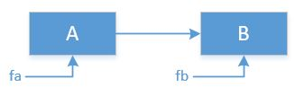
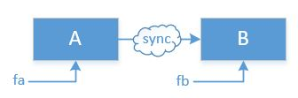
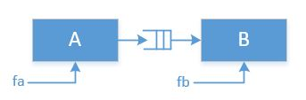
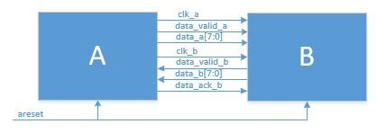

# Clock Domain Crossing Examples

### VERSION HISTORY

| **Version**  | **Date**  | **Description**                       |
|--------------|-----------|---------------------------------------|  
|  1.0         | 16-MAY-21 | Initial release                         

#### Information and Tools

|**Organization**     |                                            |
|---------------------|--------------------------------------------|  
| **FPGA Name**       |   
| **Design Name**     | 
| **File Name**       |   
| **MTS**             |[Steve April](mailto:steve.april@jpl.nasa.gov?subject=GitHub_arp-stapril)  
| **Language-1**      | SystemVerilog 
| **Device**          | XQZU29DR-FFRF1760-2I RFSOC (random selection) 
| **Tool versions**   | Xilinx Vivado 2020.2 for Synthesis and Simulation
| **Development Host**| Windows 10 Professional 64-bit.

##  Clock Domain Crossing

   
***Figure-1:  Data flowing between two clock domains fa and fb***

### Clocking Scenarios
- Clocks are same frequency and phase
- Clocks are same frequency but phase is dynamically random (plesiochronous)
- Source clock (fa) is less than destination clock (fb)
- Source clock (fa) is greater than destination clock (fb)

### Clocks are same frequency and phase
When fa and fb come from the same single clock source (fa = fb), both the frequency and phase are fixed.  This is known as a "single clock domain" system.  No clock domain crossing logic is necessary in this case.  

### Clocks are same frequency but phase is dynamically random (plesiochronous)
When fa and fb come from the different clock sources but their frequencies are the same (fa = fb), this is known as a plesiochronous system.  The phases of these two clocks may drift over time and therefore data errors may result from metastability. In this case data synchronizers are needed as shown in figure 2 below.  

### Source clock (fa) is less than destination clock (fb)
This is similar to the plesiochronous case.  Since the clock fa is less than fb, even by a large amount, the receive block A will be able to capture the data if proper synchronization is used.  

   
***Figure-2:  Data Synchronizer when fa=fb but clocks are independent***

### Source clock (fa) is greater than destination clock (fb)
When fa is much greater that fb, it is generally accepted that a FIFO is required to buffer the data to the extent that the data comes in bursts. See Figure 3. Obviously sustained data rates at the faster clock speed will eventually overflow.  

   
***Figure-3:  Data FIFO when fa>fb***

### Calculations for fa > fb
#### Example 1: 
A burst size or sustained data rate equal to the slower clock rate is needed to prevent buffer overflow.  In this example, a burst rate is given  

- Burst size = 100 words
- fa = 200 MHz
- fb = 20 Mhz

1/200 MHz = 5 ns;  1/20 MHz = 50 ns  
Length of burst = 100 x 5 ns = 500 ns   
How fast can B read this burst of data = 500 ns / 50 ns = 10 cycles   
Remaining data must be stored 100 words - 10 words = 90 words deep  
To prevent overflow, the IPG must be 500 ns - 50 ns = 450 ns  

## Testbench Design

The figure below shows two clock domains, clk_b and clk_b, along with the data and control for each interface.  In this design, block A is the test bench providing the clocks and data, and block b is the device under test (DUT).

   
***Figure-4:  Test Bench Design***

#### I/O Signals 

| Port Name     | Direction | BitWidth | Description                        |
|---------------|-----------|----------|------------------------------------| 
| rst           | Input     |    1     | Active high, asynchronous reset.    |
| clk_a        | Input     |    1     | CLock for data_a and data_valid_a.
| data_valid_a | Input     |     1     | Goes high when a valid data frame has been received and stays high for the entire duration of the received data. frame.
| data_a       | Input     |      8     | Received data. Valid when data_valid_a is high..
| clk_b        | Input     |      1     | CLock for data_b and data_valid_b  
| data_valid_b | Output    |      1     | Goes high when the first byte of the data frame begins to transmit. Block A responds with data_ack_b when it is ready to receive additional bytes.  
| data_b       | Output     |     8     | Transmit data.  Valid when data_valid_b is high.  

